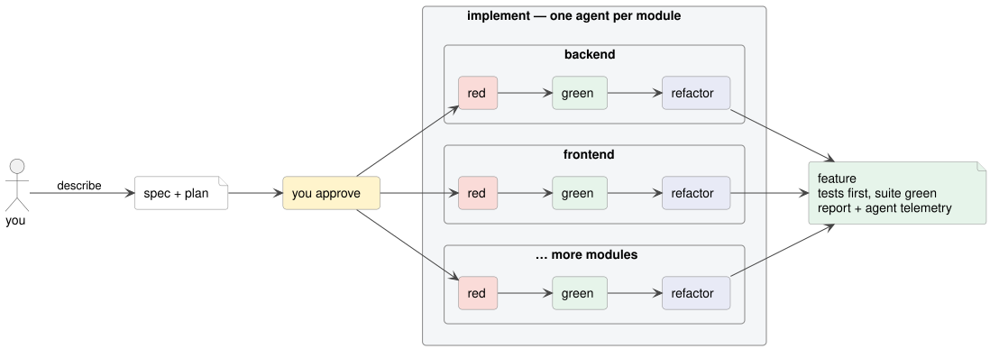
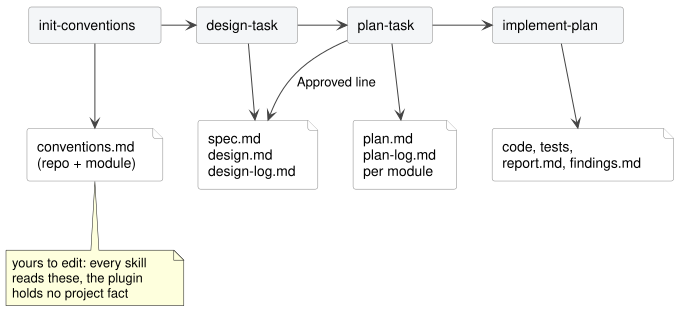

<h1 align="center">tdd-sdlc</h1>

<h3 align="center">Test-driven from the first design to the last dependency.</h3>

<p align="center">
A Claude Code plugin for the whole development cycle — features, bugs, refactorings, dependency upgrades.<br>
You approve the spec; agents write the tests, then the code, in parallel across your modules.
</p>

<p align="center">

</p>

<p align="center">
<a href="#install">Install</a> ·
<a href="#your-first-feature">First feature</a> ·
<a href="#the-whole-lifecycle">Lifecycle</a> ·
<a href="#conventions">Conventions</a> ·
<a href="#permissions">Permissions</a>
</p>

<hr>

## Why

Coding with an LLM is fast until it isn't:

- **Tests get skipped.** The next feature breaks the last one, and nobody notices until production.
- **You review the same change over and over.** Duplicated code, ignored conventions, a rewrite, a re-review.
- **One accepted mistake becomes the reference.** The model copies what is already in the repo, good or bad.
- **Big changes stall.** Frontend and backend in one epic means two sessions, two contexts, and hand-stitching.

tdd-sdlc answers each with the same move: a spec you read before any code exists, and a failing test before
any line that makes it pass.

<hr>

## What you get

<table cellpadding="12" cellspacing="0" border="0">
<tr>
<td valign="top" width="50%">
<b>Spec first, then hands-off</b><br>
<i>The plugin writes a design and a plan. You approve. It implements to the end, running your build and tests itself at every stage — nothing is taken on an agent's word.</i>
</td>
<td valign="top" width="50%">
<b>Parallel across modules</b><br>
<i>One design for the whole change, one agent per module it touches, all running concurrently.</i>
</td>
</tr>
<tr>
<td valign="top">
<b>Coverage by construction</b><br>
<i>Red before green for every class. A change without a test cannot land.</i>
</td>
<td valign="top">
<b>Make it your own</b><br>
<i>Build commands, layering, test types, commit policy, which model runs what — all set in conventions files you own. Change a file, and every agent follows.</i>
</td>
</tr>
</table>

Why it is built this way — gates over reports, files over conversation, one agent per module:
[`docs/strategy.md`](docs/strategy.md).

<hr>

## Install

```
/plugin marketplace add ds-usova/tdd-sdlc
/plugin install tdd-sdlc@tdd-sdlc
```

<hr>

## Your first feature

Four commands. Each writes a file and stops; the next one reads it.

1. `/tdd-sdlc:init-conventions` — once per repository. Surveys the tree, writes your conventions, asks only what
   it cannot deduce. Read the result and correct it.
2. `/tdd-sdlc:design-task <what you want>` — writes `docs/<n>-<task>/design.md`. Stops with open questions. You
   answer them.
3. `/tdd-sdlc:plan-task docs/<n>-<task>/design.md` — writes one `plan.md` per module: classes, tests, ordered
   steps.
4. `/tdd-sdlc:implement-plan docs/<n>-<task>/` — runs the gates, then one pipeline per plan: stabilize
   (contracts, migrations, stubs — until it compiles), red, green, refactor. Done means the suite is green and
   the task directory moved to `docs/implemented/`.

<p align="center">

</p>

What the files look like: [a design](skills/design-task/example-design.md), [a plan](templates/example-plan.md).

<hr>

## The whole lifecycle

The name is not a coincidence. Every phase of development gets a skill, and every skill is test-driven.

| Phase        | Command                                        | What it does                                                          | Safety net                                     |
|--------------|------------------------------------------------|-----------------------------------------------------------------------|------------------------------------------------|
| Feature      | `design-task` → `plan-task` → `implement-plan` | spec, plan, red-green-refactor per class                              | tests fail before code, suite green after      |
| Bug          | `/tdd-sdlc:fix-bug`                            | reproduces with a failing test, diagnoses, fixes; logs failed attempts | the reproducing test turns green               |
| Refactoring  | `/tdd-sdlc:rework`                             | restructures code without changing behaviour; stops for approval      | suite green before, kept green after each step |
| Dependencies | `/tdd-sdlc:upgrade-deps`                       | finds outdated and vulnerable libraries, upgrades one step each       | suite green before, kept green after each step |

Every line stops for your approval before it touches code. Every line spawns one agent per module. A bug
found on the way, a refactoring worth doing later, or a behaviour the change should also have had, becomes a
row in `docs/backlog.md` — the input for the next `fix-bug`, `rework` or `design-task` run. How `implement-plan` gates and parallelizes: [`docs/implement-plan.md`](docs/implement-plan.md).

<hr>

## Conventions

Everything the plugin does in your repository, it does because a conventions file says so.

- `init-conventions` writes them from what your tree already does. You edit them like any other document.
- Two tiers: `docs/conventions.md` for the repository, `<module>/docs/conventions.md` per module.
- Per module, one file per concern: what it is built from, where code goes, how tests are named and
  typed, code idioms, the exact build commands, what runs after a change, how agents commit and parallelize.
- A *module* is whatever has its own build and test command. The plugin never guesses; it asks.
- **They outlive the plugin.** Conventions describe your project, not tdd-sdlc. Drop the plugin and they still
  brief any model or any newcomer.

Templates and the section-by-section reference: [`templates/conventions/`](templates/conventions/README.md).

<hr>

## Requirements

- `bash`, `awk`, `sed`, `git`, `find`, `grep` on `PATH`. On Windows that is Git Bash.
- `jq`, for the one shipped hook. It refuses a commit message that names a plan step id (`ST01`, `GU05`, …),
  since those ids die with the archived task. Without `jq` the hook exits silently.
- Conventions files. Without them `design-task` and `plan-task` stop and ask for `init-conventions`.

## Permissions

- The agents need to run your build and tests and to read your code. Grant that, and `implement-plan` runs
  unattended.
- The plugin's scripts need allow rules. Every one is listed in [`settings.json`](settings.json) at the plugin
  root; copy them into your `.claude/settings.json`, or choose "always allow" on the first prompt.
- A refused script never stops a run; the skill falls back to reading the file.
- The plugin commits only where your conventions say so. Silent means no commits.

<hr>

## Layout

| Directory         | Holds                                                     |
|-------------------|-----------------------------------------------------------|
| `skills/<name>/`  | `SKILL.md` and the references only that skill reads       |
| `agents/`         | every sub-agent a skill spawns; none is for direct use    |
| `scripts/<name>/` | the reader for one file format, its parser and its README |
| `templates/`      | files more than one skill reads; `conventions/` templates |
| `hooks/`          | the one shipped hook                                      |
| `docs/`           | diagrams and reference pages                              |

Working on the plugin itself: [`docs/developing.md`](docs/developing.md).
