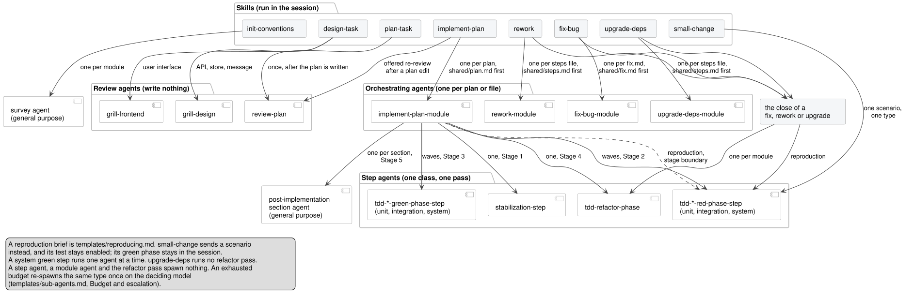

# Who spawns whom

Four kinds of agent, one rank per row.

| Kind          | Agents                                                                                     | Spawned by                                   | Spawns                         |
|---------------|--------------------------------------------------------------------------------------------|----------------------------------------------|--------------------------------|
| Skill         | `init-conventions`, `design-task`, `plan-task`, `implement-plan`, `fix-bug`, `rework`, `upgrade-deps`, `small-change` | the user, in the session   | review, orchestrating and red agents |
| Review        | `grill-design`, `grill-frontend`, `review-plan`, `review-plan-facts`                       | `design-task`, `plan-task`, `implement-plan`; `review-plan-facts` by `review-plan` | `review-plan` spawns `review-plan-facts`; none writes anything |
| Orchestrating | `implement-plan-module`, `fix-bug-module`, `rework-module`, `upgrade-deps-module`          | the skill of the same name, one per plan or steps file, the shared one first and alone | `implement-plan-module` spawns the step agents; the three module agents spawn nothing |
| Step          | `stabilization-step`, the three red and three green `tdd-*-phase-step` agents, `tdd-refactor-phase` | `implement-plan-module`; the red agents also by any skill or pipeline with a reproduction brief, and by `small-change` with one scenario; the refactor pass also by `fix-bug` and `rework` | nothing |

Two general-purpose agents carry no file of their own: the survey agent `init-conventions` runs per module, and
the agent `implement-plan-module` spawns per post-implementation section.

`small-change` is the one skill that spawns at most one agent and writes the production code in the session
itself. It has no module agent, and no file of steps for one to read.

What each agent cost: [`cost-recording.md`](cost-recording.md).

**Escalation** spawns the same type once more, on the deciding model
([`templates/sub-agents.md`](../plugin/templates/sub-agents.md), **Budget and escalation**). It adds no edge.

*Diagram source: [`diagrams/agents.puml`](diagrams/agents.puml). Re-render with `diagrams/render.sh`.*
