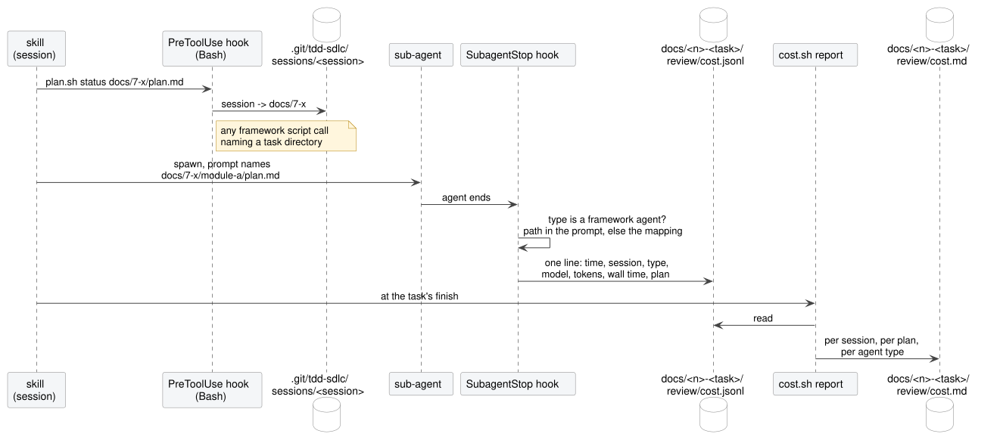
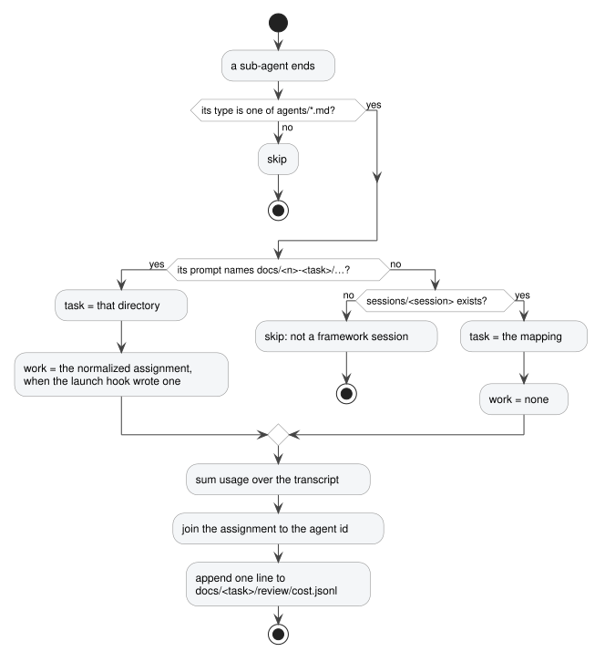

# Recording what a run costs

Your conventions assign a model to each kind of agent the plugin spawns
([`conventions-contract.md`](conventions-contract.md)). This page says
what those choices cost. After every `implement-plan`, `fix-bug`, `rework` or `upgrade-deps` run, the task
directory holds `review/cost.md`: what each agent cost in dollars, tokens and time, and a timeline of when
everything ran. Nothing has to be switched on.

## Terms

- **Task directory**: `docs/<n>-<task>/`, where `<n>` is the task's number. Archiving moves the whole directory
  to `docs/implemented/` ([`README.md`](../README.md)).
- **Framework agent**: any sub-agent type shipped under `agents/`, such as `tdd-unit-red-phase-step` or
  `review-plan`. Which skill spawns which is [`agents.md`](agents.md).
- **Pipeline**: the `implement-plan-module` agent that runs one plan. A task with several modules has one plan
  and one pipeline per module, plus a `shared` plan that runs first ([`implement-plan.md`](implement-plan.md)).
- **Step**: an agent a pipeline spawns for one class or one test class. Steps run in **waves**, batches of
  steps in parallel.
- **Session**: the Claude Code session you typed the command into. The skill's own work happens there; agents
  are its sub-agents.
- **Transcript**: the JSON-lines file Claude Code writes per session and per sub-agent. The numbers on this
  page come from transcripts, never from anything an agent says about itself.

## The report

`review/cost.md` opens with two tables for the whole task, one row per session that worked on it and one
row per agent type. The first answers "did this cost a lot":

```
| agent                   | n | $      | %   | read $ | write $ | out $ | time | model           |
|-------------------------|---|--------|-----|--------|---------|-------|------|-----------------|
| session (own turns)     | 1 | $3.89  | 22% | $1.50  | $2.20   | $0.19 | 60m  | claude-opus-5   |
| grill-design            | 1 | $2.10  | 12% | $0.90  | $0.80   | $0.40 | 7m   | claude-opus-5   |
| review-plan             | 1 | $1.40  | 8%  | $0.60  | $0.55   | $0.25 | 6m   | claude-opus-5   |
| implement-plan-module   | 3 | $8.70  | 49% | $6.10  | $1.80   | $0.80 | 29m  | claude-opus-5   |
| tdd-unit-red-phase-step | 5 | $1.60  | 9%  | $0.70  | $0.60   | $0.30 | 5m   | claude-sonnet-5 |
```

- **session (own turns)** is the skill itself: the designer, the planner, the task level of `implement-plan`.
  They run in the session, not as sub-agents, so their cost is one row. A task resumed in a new session has
  one session row per session.
- **n** is how many agents of that type ran. **$** is what they would have cost at API rates. **%** is the
  share of the task's total.
- **read $**, **write $** and **out $** split the dollars by what was priced: input and cache reads, cache
  writes, output.
- **time** is the type's span from its first start to its last end. Times nest: a pipeline's minutes contain
  its steps' minutes. Dollars add up across rows; minutes never do.
- **model** lists every model the rows answered with. The session row lists each model its own messages
  used, and each message is priced at its own model.

The second says what moved:

```
| agent                   | turns | input | output | cache write | cache read | peak ctx | of window |
|-------------------------|-------|-------|--------|-------------|------------|----------|-----------|
| session (own turns)     | 31    | 62    | 7.6k   | 220k        | 3.0M       | 140k     | 14%       |
| grill-design            | 12    | 40    | 6.1k   | 110k        | 1.1M       | 120k     | 12%       |
| review-plan             | 9     | 35    | 4.0k   | 90k         | 0.7M       | 110k     | 11%       |
| implement-plan-module   | 167   | 540   | 60.9k  | 555k        | 40.2M      | 310k     | 31%       |
| tdd-unit-red-phase-step | 60    | 210   | 21.0k  | 190k        | 3.9M       | 90k      | 45%       |
```

- **turns** is how many messages the agents of that type sent.
- **input**, **output**, **cache write** and **cache read** are the four token counts, one per column and
  never summed: they are priced differently, so their sum corresponds to nothing.
- **cache read** is not new tokens. It is the conversation prefix, re-read from cache on each turn, and it
  grows with roughly the square of the turn count. A long agent shows tens of millions; a short one does not.
- **peak ctx** is the largest one message's input + cache write + cache read: the most context the agent
  carried at once. A type's is its largest agent's. **of window** is that against the model's context window.

Each table is followed by the sentence that says what its columns are. Below them come a per-plan split
(`plan`, `agents`, `$`, `time`), a task total (`$` and one span from the first framework call to the report),
and the timelines.

### Prices

Each token count is priced at the model's rates, per million tokens:

| Quantity      | Price, relative to the model's input rate       |
|---------------|-------------------------------------------------|
| `input`       | 1×                                              |
| `cache_write` | 1.25× at the 5-minute TTL, 2× at the 1-hour one |
| `cache_read`  | 0.1× (0.025× on Claude Fable 5.1)               |
| `output`      | the model's output rate, 5× on current models   |

A subscription plan is not billed this way; the dollars say what the run would cost at API rates, which is
the one scale on which two runs compare.

**An agent whose model is in no table** is priced nowhere. A row that holds only such agents renders `—` in
every priced cell. A row that mixes them with priced agents shows the priced sum and ends with `*`. The
task total and every `%` are computed over the priced agents only, the total ends with `*`, and a line under
it names the models: `* excludes 1 unpriced agent (claude-x)`. Nothing is guessed and no rate is borrowed
from a model with a similar id. The volume table is complete regardless.

### Where the rates come from

Two tables the transcript does not carry: dollars per million tokens per model, and the context window per
model. Both are current without anyone editing a file or waiting for a release:

1. **Bundled defaults ship with the plugin**, `scripts/cost/pricing.json`: per model id, the input and
   output rate, the cache read multiplier where it is not 0.1, the cache write multipliers where they are
   not 1.25 and 2, the context window, and the date the file was written. `cost.sh refresh-pricing`
   rewrites it from the pages below, before a release, as `docs/developing.md` says. A machine without
   internet renders from it, and the header says `Rates: the plugin's table, dated <date>.`
2. **A fetched copy is cached per user**, at `$XDG_CACHE_HOME/tdd-sdlc/pricing.json`, which defaults to
   `~/.cache/tdd-sdlc/pricing.json` (under Git Bash on Windows, `C:\Users\<user>\.cache\...`).
   `cost.sh report` fetches the published pricing and models pages, parses their tables and rewrites the
   cache in exactly two cases:
   - a model id the report needs, from `cost.jsonl` or from the session transcript's `message.model`, is in
     neither the cache nor the bundled file. An id is looked up as written, then without a trailing
     `-YYYYMMDD`;
   - the cache is older than seven days.

   The cache is the fetched rows merged over the bundled file, so a bundled model the pages no longer list
   keeps its bundled rate. A model neither lists is written into the cache as `missing` with the date, and
   a failed fetch writes its date and reason. Either is retried only when that date is more than a day old.
   A cache that has never been fetched ages from its failure's date. Otherwise the report reads the cache,
   or the bundled file when there is no cache, and does not touch the network. The header says
   `Rates: fetched <date>.`
3. **A failed fetch or parse falls back and says so**: the cached copy first, the bundled defaults second.
   The fetch runs with `curl --max-time 10`; a missing `curl` is a failed fetch, not an error; nothing goes
   to stderr.

   ```
   Rates: cached copy from 2026-09-08 (fetching current rates failed: curl: (6) Could not resolve host).
   Rates: the plugin's table, dated 2026-09-10 (fetching current rates failed: no model table on the pricing page).
   ```

The `Rates:` line stands in the report's header and `cost.sh report` prints it to stdout after the report's
path, and the skill that ran it shows the person what the command printed.

The pages are `platform.claude.com/docs/en/about-claude/pricing.md` and
`platform.claude.com/docs/en/models/overview.md`, served as markdown. `scripts/cost/pricing-parse.awk` reads
the pricing page's model table and the models page's comparison table: a model's id, alias and context window
come from the models page where it lists the model, else the id is derived from the name and the window is
unknown, rendered `—`.

### Times

`cost.jsonl` is the machine-readable record and stays UTC, portable and comparable across machines. Only
`cost.md` is rendered in local time, from the offset the hooks recorded, never from the rendering machine's
zone or `TZ`:

- **One offset per report**: the mapping file's, since the report's own call has just rewritten it; else the
  offset of the agent line with the latest `ended`; else UTC. Every row, the timeline's axis, the task total's
  span and the header use it. A row recorded under another offset is not converted separately.
- **The header names it**: `Written by scripts/cost/cost.sh report at 2026-09-10 01:06:51. Times are
  UTC+02:00, the offset of the latest record.` With no offset recorded anywhere: `Times are UTC: no offset
  recorded.`
- **Durations are unaffected.**

### Reading a timeline

One overview for the task, then one timeline per plan. A row is an agent: its name, the clock time it
started and ended, a bar, its time, its dollars and its peak context. Each column of the bar is a slice of
the timeline's span; a `█` is a column the agent was running in, a `·` one it was not. The axis above the
bars carries clock times. Columns are one minute wide where the span fits in forty columns, wider where it
does not.

Agents of one type under one parent are grouped: a row `type ×3` carries the group's span, summed dollars
and largest peak context, and its members follow as `#1`, `#2`, `#3`. A wave reads as members sharing a
start time. A waiting pipeline reads as a long bar over short ones.

The example is a two-module task with a seam: design and plan in the same session, the shared plan first and
alone, then both module pipelines in parallel.

```
task 7-add-widget · overview
agent                                start  end    13:40     14:00     14:20       time        $  peak ctx
session (own turns)                  13:40  14:40  ██████████████████████████████   60m    $3.89      140k
grill-design                         13:42  13:49  ·████·························    7m    $2.10      120k
review-plan                          13:55  14:01  ·······████···················    6m    $1.40      110k
implement-plan-module shared         14:05  14:09  ············███···············    4m    $0.90       90k
implement-plan-module module-a       14:09  14:34  ··············█████████████···   25m    $4.60      310k
implement-plan-module module-b       14:09  14:30  ··············███████████·····   21m    $3.20      260k
```

```
module-a/plan.md
agent                                start  end   14:09     14:19     14:29  time        $  peak ctx
implement-plan-module                14:09  14:34  █████████████████████████   25m    $4.60      310k
  stabilization-step                 14:09  14:12  ███······················    3m    $0.70       80k
  tdd-unit-red-phase-step ×3         14:13  14:16  ····███··················    3m    $0.95       90k
    #1                               14:13  14:15  ····██···················    2m    $0.30       70k
    #2                               14:13  14:15  ····██···················    2m    $0.30       60k
    #3                               14:13  14:16  ····███··················    3m    $0.35       90k
  tdd-integration-red-phase-step     14:13  14:17  ····████·················    4m    $0.60       85k
  tdd-unit-green-phase-step ×3       14:18  14:21  ·········███·············    3m    $0.45       50k
    #1                               14:18  14:19  ·········█···············    1m    $0.15       40k
    #2                               14:18  14:20  ·········██··············    2m    $0.15       45k
    #3                               14:18  14:21  ·········███·············    3m    $0.15       50k
  tdd-integration-green-phase-step   14:21  14:24  ············███··········    3m    $0.40       60k
  tdd-system-green-phase-step        14:24  14:25  ···············█·········    1m    $0.05       30k
  tdd-refactor-phase                 14:27  14:33  ··················██████·    6m    $1.30      200k
```

```
module-b/plan.md
agent                                start  end   14:09     14:19     14:29  time        $  peak ctx
implement-plan-module                14:09  14:30  █████████████████████   21m    $3.20      260k
  stabilization-step                 14:09  14:11  ██···················    2m    $0.50       70k
  tdd-unit-red-phase-step ×2         14:12  14:14  ···██················    2m    $0.55       75k
    #1                               14:12  14:14  ···██················    2m    $0.30       75k
    #2                               14:12  14:13  ···█·················    1m    $0.25       60k
  tdd-system-red-phase-step          14:12  14:17  ···█████·············    5m    $0.80      120k
  tdd-unit-green-phase-step ×2       14:18  14:20  ·········██··········    2m    $0.25       45k
    #1                               14:18  14:19  ·········█···········    1m    $0.10       40k
    #2                               14:18  14:20  ·········██··········    2m    $0.15       45k
  tdd-system-green-phase-step        14:21  14:23  ············██·······    2m    $0.20       50k
  tdd-refactor-phase                 14:24  14:29  ···············█████·    5m    $1.10      180k
```

A fix, a rework or an upgrade has the overview only, since its module agents spawn no steps. Its rows are the
session, the shared module agent, the module agents in parallel, then the refactor pass per module and any
reproduction at the finish. An upgrade has no refactor pass.

```
fix 12-widget-listed-twice
agent                                start  end    15:10     15:20     15:30     15:40       time        $  peak ctx
session (own turns)                  15:10  15:44  ██████████████████████████████████   34m    $2.30      120k
fix-bug-module shared                15:16  15:19  ······███·························    3m    $0.60       80k
fix-bug-module module-a              15:19  15:31  ·········████████████·············   12m    $2.10      210k
fix-bug-module module-b              15:19  15:27  ·········████████·················    8m    $1.50      170k
tdd-refactor-phase module-a          15:32  15:37  ······················█████·······    5m    $0.90      150k
tdd-refactor-phase module-b          15:32  15:35  ······················███·········    3m    $0.60      120k
tdd-unit-red-phase-step module-a     15:38  15:40  ····························██····    2m    $0.20       50k
```

### What to do with it

- **Set the models.** Your conventions name an executing model for step
  work and a deciding model for review and refactoring. The per-type rows say what each choice costs.
- **Find the long tail.** A single agent far above its type's average is one that looped. The budget rule
  stops that after three attempts and escalates once to the deciding model
  ([`templates/sub-agents.md`](../templates/sub-agents.md), **Budget and escalation**); every escalation is an
  `RL` note in the plan log, which names the step.
- **Watch the window.** An agent whose `of window` nears 100% is one about to lose its earliest context. A
  peak that high on a step agent says the step's brief is too large.
- **Assert a budget.** A plugin eval can read `cost.jsonl` and fail when a type exceeds a budget, so a cost
  regression fails a test.

## How the numbers are collected

<p align="center">

</p>

Two hooks, registered by the plugin in `hooks/hooks.json`, and one script.

1. **`PreToolUse` on Bash** (`scripts/hooks/map-session-to-task.sh`) watches for a call to a framework
   script — `plan.sh`, `fix.sh`, `rework.sh`, `upgrade.sh`, `design.sh`, `cost.sh` — that names a task
   directory. It writes that directory to `.git/tdd-sdlc/sessions/<session>`, with the session's transcript
   path, the time of the first such call, the time of the latest and the machine's UTC offset at the latest.
   Every skill makes such a call before it
   spawns anything, so a framework session is always mapped. A session that never makes one is not a framework
   session. Mapping files older than 30 days are deleted on the next write; losing one only means later agents
   of that session without a plan path in their prompt go unrecorded.
2. **`SubagentStop`** (`scripts/hooks/record-agent-cost.sh`) fires once, when a sub-agent ends. It decides
   whether and where to record ([below](#how-an-agent-is-attributed)), reads the agent's transcript, and
   appends one JSON line to `docs/<n>-<task>/review/cost.jsonl`. The start time is the transcript's first
   timestamp and the end time its last, so no start hook is needed. The file moves with the task at archive and is never
   cleaned.
3. **`cost.sh report <task>`** (`scripts/cost/cost.sh`, usage in [its README](../scripts/cost/README.md)) reads
   `cost.jsonl` and writes `cost.md`. `implement-plan` runs it before archiving; `fix-bug`, `rework` and
   `upgrade-deps` run it at their finish. The session row comes from the session transcript the mapping
   names, grouped by `message.id` as the hook groups and summed between the session's first framework call
   and its latest; the report's own call is the latest, so the running session is summed to now. Every row
   is priced from the rates table ([above](#where-the-rates-come-from)), and the `Rates:` line goes to
   stdout after the report's path. The report is a snapshot; running it again recomputes.

Both hooks are silent without `jq`, like the other hooks.

### One line per agent

| Field      | Value                                                                       | Source                 |
|------------|-----------------------------------------------------------------------------|------------------------|
| `id`       | the agent id                                                                | the hook's input       |
| `parent`   | the id of the agent that spawned it; absent when the session did            | the agent's meta file  |
| `started`  | the first message's timestamp                                               | the transcript         |
| `ended`    | the last message's timestamp                                                | the transcript         |
| `session`  | the session id                                                              | the hook's input       |
| `agent`    | the agent type, one of `agents/*.md`                                        | the hook's input       |
| `model`    | the model that answered                                                     | the transcript         |
| `turns`    | how many messages the agent sent: distinct `message.id`s                    | the transcript         |
| `tokens`   | `input`, `output`, `cache_read`, `cache_create_5m`, `cache_create_1h`       | the transcript, summed |
| `peak_ctx` | the largest one message's input + cache write + cache read                  | the transcript         |
| `seconds`  | wall time from first to last message, waiting included                      | the transcript         |
| `offset`   | the machine's UTC offset when the hook fired, as `date +%z` prints it       | the hook               |
| `plan`     | the plan path the agent was spawned with, where its prompt names one        | the transcript         |

The transcript holds one line per content block, and every line of one message repeats the whole message's
usage. The hook groups the assistant lines by `message.id`, keeps the last line of each group, and sums those.
A line without a `message.id` is a group of its own. A message without the cache write split is counted at
the 5-minute TTL.

An agent can stop more than once: a pipeline that hands a wave back stops, is resumed, and stops again, and the
hook fires each time. Every stop appends a line; the report keeps the last line per `id`.

A line written before the hook recorded `turns`, `cache_create_5m`, `cache_create_1h`, `peak_ctx` and
`offset` is skipped, after the last-per-id rule, and the report's header counts it: `N lines recorded before
the format change are skipped`. No column carries a legacy value.

## How an agent is attributed

<p align="center">

</p>

- **Only framework agents are recorded.** A `general-purpose` or `Explore` agent is skipped, whatever session
  it runs in. The survey agents `init-conventions` spawns and the agents that run a plan's post-implementation
  steps are general-purpose and go unrecorded.
- **The agent's own prompt names its task.** A pipeline is spawned with its plan path; a grill or a reviewer
  with the task directory; a step with its plan path. The plan path names the plan the agent worked on, which
  is how two plans of one task are told apart, and the task with it. Two tasks worked in one session cannot
  misfile each other.
- **The session mapping is the fallback.** An agent whose prompt names no path is filed under the session's
  mapped task. No mapping, no record. A task directory the tree does not hold is never created.
- **A step without a known parent joins its plan.** This happens when the meta file was missing when the agent
  stopped. Its row still lands under the pipeline for its plan.
- **A plan run twice gets two timelines.** A second pipeline for the same plan is drawn as `<plan> (2)`.

**Parallel pipelines** serve one task and land in one file, split per plan. **A task resumed in a new session**
gets a new mapping at that session's first script call; the report shows two sessions of one task. **A stray
script call** from an ordinary session maps it, but nothing is recorded unless a framework agent is spawned
there too.

## What is not recorded

- The session's turns before its first framework call. The session row starts there.
- Anything an agent says about its own work.
- Anything from a session with no framework script call.

## What the host provides

The hooks rely on these Claude Code behaviours, measured on 2026-09-08 and 2026-09-10. The `SubagentStop` event and its
stdin are in Claude Code's hooks reference. The transcript's line shape, the meta file, and how nested agents
report are not documented, and were measured. If an update changes them, recording degrades silently and
`cost.md` shows fewer rows.

1. **`SubagentStop` stdin** carries `session_id`, `transcript_path` (the session's), `cwd`, `agent_id`,
   `agent_type`, `agent_transcript_path`, `last_assistant_message`, `hook_event_name`, `stop_hook_active`. A
   plugin agent arrives as `<plugin>:<type>`, such as `tdd-sdlc:rework-module`; the hook strips the prefix.
2. **The transcript** is JSON lines, one line per content block: a message that thinks, says a sentence and
   calls a tool is three lines. A line with `"type": "assistant"` carries `timestamp`, `message.id`,
   `message.model` and `message.usage` with `input_tokens`, `output_tokens`, `cache_creation_input_tokens`,
   `cache_read_input_tokens` and `cache_creation.ephemeral_5m_input_tokens` /
   `cache_creation.ephemeral_1h_input_tokens`. Every line of one message carries the whole message's usage;
   `output_tokens` grows line by line and the last line holds the message's total. The first line with
   `"type": "user"` is the prompt. Beside every sub-agent
   transcript sits `agent-<id>.meta.json` with `agentType`, `description`, `spawnDepth`, `parentAgentId` for an
   agent another agent spawned, and `model` where the spawn set one.
3. **Grandchildren fire the hook.** A step a pipeline spawned stops and is reported like the pipeline itself.
4. **`session_id` is the top session's** for a grandchild, and so is its transcript's directory:
   `<projects>/<session>/subagents/agent-<id>.jsonl`.
5. **One agent stops several times.** A parent stops once while waiting on its child and once at the end.

*Diagram sources: [`diagrams/cost-flow.puml`](diagrams/cost-flow.puml),
[`diagrams/cost-attribution.puml`](diagrams/cost-attribution.puml). Re-render with `diagrams/render.sh`.*
