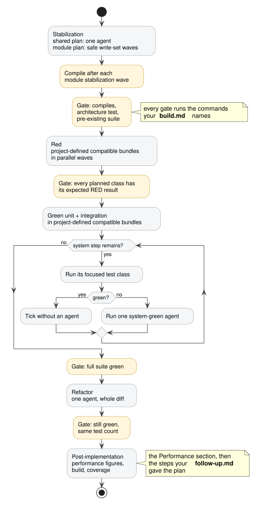
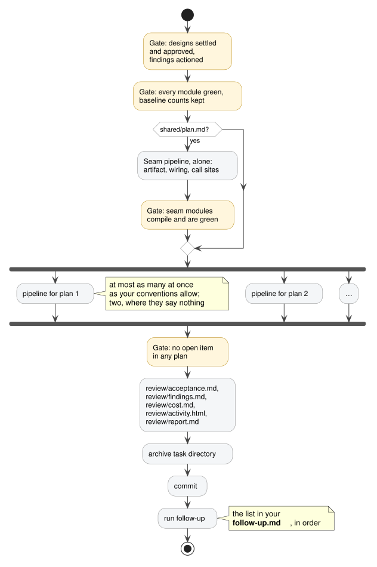

# Inside implement-plan

## Three levels

- A *task* spans modules and has one design.
- A *pipeline* is one plan for one module, run by one agent.
- A *step* is one class or one test class, run by one agent.

Each level coordinates only the one below. The plan is the input: a settled design, every class and test
scenario named. Nothing here reads the design — the plan carries everything a step needs.

## One pipeline

Each stage ends with a *gate*: a command — build, suite, test count, architecture check — whose
real output decides whether the next stage runs. The pipeline runs it itself, never taking a step agent's word.
A yellow box in the diagram is a gate.

- **Stabilize**
  - Writes contracts, migrations, stubs: everything the module needs to compile before any test exists.
  - May disable a test whose behaviour the plan replaces; re-enables it before the pipeline ends.
  - *Gate: the module compiles and the pre-existing suite is green.*
- **Red**
  - One step per class writes its test class.
  - Steps run in *waves* — batches of concurrent agents, sized by the concurrency limit your conventions set.
    Every test compiles against the stubs, so no red step waits on another.
  - *Gate: each test compiles and fails.*
- **Green**
  - One step per class writes the class until its test class passes.
  - Steps are ordered by the plan's `after:` field: a step lists the classes its tests call unmocked, and starts
    only once those are green.
  - System-test green steps run one at a time; each may change code anywhere in the module.
  - *Gate: the suite is green.*
- **Refactor**
  - One pass cleans the whole diff, with the suite as the safety net.
  - *Gate: the suite is green with the same test count, and no stub marker remains in a file stabilization
    recorded — a stub no scenario covered would otherwise ship as a stub.*

Three test types, each with its own red agent and its own green agent:

- A *unit* test drives one class in isolation; its collaborators are mocked.
- An *integration* test drives one class against the real thing it talks to — a database in a test container,
  a message broker, the framework's own request handling — with the rest of the module mocked.
- A *system* test drives the running module through its entry point, every dependency real and wired.

A fourth type has no red or green step:

- A *performance* test drives the running module under a stated load and measures a figure — latency,
  throughput, memory — against the threshold the spec states. A post-implementation step writes it and runs it
  once, after the refactor; another kind of step reruns a test that already exists, where you asked for a fresh
  figure. The figure is recorded beside the threshold, never gated on. A missed threshold is a **Performance**
  row in the findings file and a row in `docs/backlog.md`.

Your module's testing conventions decide which parts of the code get which type, whether performance is
measured and with what, and which model runs each step.

## One task

The task level gates the plans, lands `shared/plan.md` first if there is one — whatever crosses between modules,
such as a schema both builds read — then runs one `implement-plan-module` agent per plan, concurrently up to the cap
the conventions set, two where they set none. Each agent runs one pipeline. Each pipeline's whole-plan guardrail is
the last full suite run its module gets. A pipeline writes only inside its module, so nothing moves that module's tree
after it returns. The task level then checks one thing: no open item in any plan. Then it archives. A module whose
files moved after its guardrail is a defect. Its suite is rerun and the defect is reported.

*Diagram sources: [`implement-plan-task.puml`](diagrams/implement-plan-task.puml),
[`implement-plan-pipeline.puml`](diagrams/implement-plan-pipeline.puml). Re-render with `diagrams/render.sh`.*

## After implement-plan

The feature workflow ends here. The run writes `review/report.md` into the task directory — what was done, what
was measured, what it cost, what is open, what a person still has to check, with a link to every file — and
beside it `review/findings.md`: what it found and could not do — bugs, refactoring candidates, deferred changes
— every row of which is appended to `docs/backlog.md`. The task directory moves to `docs/implemented/`, and
whatever your module's conventions list as running after a change is run.

Where this shape comes from and where it is going: [`strategy.md`](strategy.md) — the plugin's direction, not
required reading for using it.
