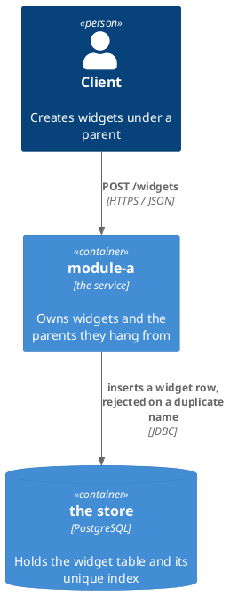
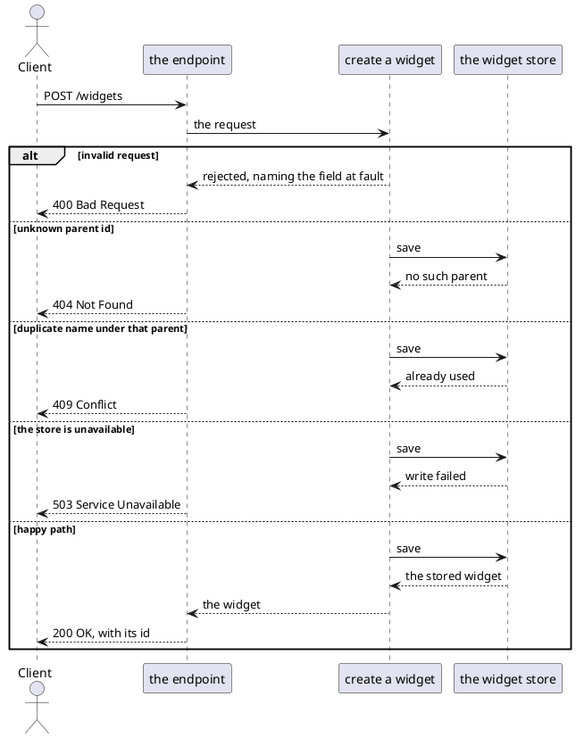

# Example Design — Worked Example

The design beside [`example-spec.md`](example-spec.md) — in a real repo `docs/1-add-widget/design.md`. The spec
says what is promised; this says how it is built, at one level above the code. The schema format and the failure
vocabulary are whatever the module's `docs/conventions.md` records (see `templates/conventions/`). What transfers
is the structure, the section order and [`stack-neutral-design.md`](../../templates/stack-neutral-design.md).
Source-backed reasoning appears in [`example-design-log.md`](example-design-log.md). Implementation placement
appears in [`templates/example-plan.md`](../../templates/example-plan.md).

---

# Design: Add Widget Creation

**Affected Modules:** `module-a`

## Proposed Solution

`POST /widgets` joins the module's API contract, taking a `CreateWidgetRequest` — `name` and `value`, both
required — and answering a `Widget` with its generated id. A widget belongs to a parent, named by `parentId`.

### Diagrams

`module-a`'s conventions name no diagram language, so these use the assumed default. There is no component
diagram: classes belong to the plan.



**Affected Modules** lists one module, so nothing crosses between two. The diagram still answers what this change
reaches outside the module — the caller and the store — which is where every failure mode in the log's Concerns
comes from.



Five branches, five scenarios: AC01 to AC05 in the spec.

### Details

What the diagrams cannot hold: a field, an invariant, a status, the schema.

| A widget holds | Refuses                                      |
|----------------|----------------------------------------------|
| `parentId`     | a parent that does not exist                 |
| `name`         | blank, or already used under the same parent |
| `value`        | over 255 characters                          |

| The caller gets | When                        |
|-----------------|-----------------------------|
| 400             | a field is missing or blank |
| 404             | the `parentId` is unknown   |
| 409             | the name is already used    |
| 503             | the write failed            |

The `widget` table is created by a migration:

```sql
CREATE TABLE widget (
    id        BIGSERIAL PRIMARY KEY,
    parent_id BIGINT       NOT NULL REFERENCES parent (id) ON DELETE CASCADE,
    name      VARCHAR(255) NOT NULL,
    value     VARCHAR(255) NOT NULL
);

CREATE UNIQUE INDEX idx_widget_parent_name ON widget (parent_id, name);
```

The unique index is what enforces RQ02 and decides the concurrent case — DN04, one request wins — so the guarantee
holds across two service instances.
