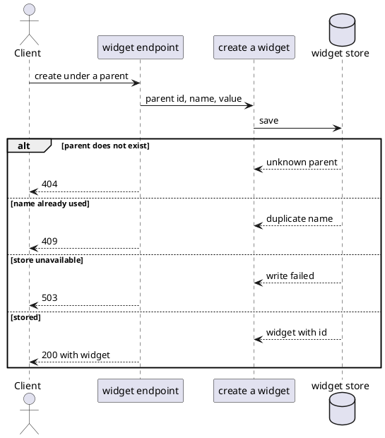

# Widget Creation Flow

```plantuml
@startuml
actor Client
participant "widget endpoint" as API
participant "create a widget" as Create
database "widget store" as Store

Client -> API : create under a parent
API -> Create : parent id, name, value
Create -> Store : save
alt parent does not exist
    Store --> Create : unknown parent
    API --> Client : 404
else name already used
    Store --> Create : duplicate name
    API --> Client : 409
else store unavailable
    Store --> Create : write failed
    API --> Client : 503
else stored
    Store --> Create : widget with id
    API --> Client : 200 with widget
end
@enduml
```
