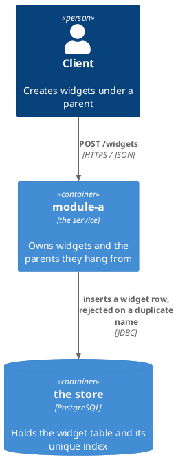
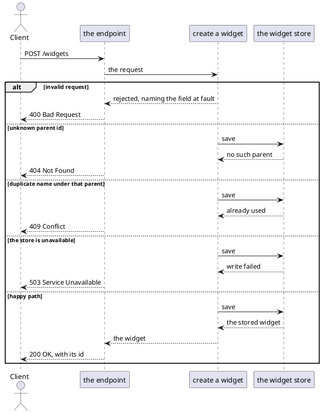

# Example Design — Worked Example

This is a complete worked example of a design file produced by the `design-task` skill — in a real repo this file
would live at `docs/1-add-widget/design.md`, beside the `plan.md` written from it. It is illustrated with a
`Widget` feature purely for concreteness; the classes, the schema format and the failure vocabulary are whatever
the module's `docs/conventions.md` records (see `templates/conventions/`). What transfers is the
structure: the sections, their order, and the decision format.

[`templates/example-plan.md`](../../templates/example-plan.md) is the plan written from this design —
the same feature, one stage later.

Every decision below is answered, which is what makes the design finished. An entry still awaiting the user has the
same three lines with an empty `Answer:` and a `Basis: must-decide — [what the repository does not say]`; **D7**
shows what one looks like once it has been answered.

**Decisions is short on purpose.** Three entries, because three questions needed the user. The nine questions the
repository answered are **Design Findings** rows — asked, answered and citable as `F1`…`F9`, without a reader
having to scroll past them to find the three that matter.

---

# Design: Add Widget Creation

**Affected Modules:** `module-a`

## Objective

Allow API clients to create widgets. A widget has a `name` and a `value`; it is validated, persisted, and returned
with its generated id. It belongs to a parent resource, which must exist.

## Context

| What exists                         | Where                    | What this change does with it                                          |
|-------------------------------------|--------------------------|------------------------------------------------------------------------|
| The parent resource, the closest existing shape | `<parent-usecase-file>`  | Mirrored throughout — same layering, same adapter style, same error vocabulary |
| The parent's persistence adapter    | `<parent-adapter-file>`  | Its failure classification is the evidence D2 rests on                 |
| The module's API contract           | `<api-schema-file>`      | Gains `POST /widgets`                                                  |
| The parent table and its cascade    | `<migration-file>`       | The widget table hangs off it, D10                                     |

## Proposed Solution

`POST /widgets` joins the module's API contract (`<api-schema-file>`), taking a `CreateWidgetRequest` — `name` and
`value`, both required — and answering a `Widget` with its generated id. A widget belongs to a parent, named by
`parentId`.

### Diagrams

`module-a` names no **Diagram Format** in its conventions, so these use the assumed default. There is no component
diagram: classes belong to the plan.



**Affected Modules** lists one module, so nothing crosses between two. The diagram still answers what this change
reaches outside the module — the caller and the store — which is where every failure mode below comes from.



### Details

What the diagrams cannot hold: a field, a signature, an invariant, a status, a setting.

| A widget holds | Refuses                                      |
|----------------|----------------------------------------------|
| `parentId`     | a parent that does not exist                 |
| `name`         | blank, or already used under the same parent |
| `value`        | over 255 characters                          |

| The caller gets | When                        |
|-----------------|-----------------------------|
| 400             | a field is missing or blank |
| 404             | the `parentId` is unknown   |
| 409             | the name is already used    |
| 503             | the write failed            |

The `widget` table is created in migration `<migration-file>`:

```sql
CREATE TABLE widget (
    id        BIGSERIAL PRIMARY KEY,
    parent_id BIGINT       NOT NULL REFERENCES parent (id) ON DELETE CASCADE,
    name      VARCHAR(255) NOT NULL,
    value     VARCHAR(255) NOT NULL
);

CREATE UNIQUE INDEX idx_widget_parent_name ON widget (parent_id, name);
```

## Acceptance Scenarios

One per branch of the flow above. `POST /widgets` is the only entry point.

- **A1:** a widget is created
  - Given: a parent exists, and it has no widget named `left-rail`
  - When: the caller posts `parentId`, `name: left-rail` and a value
  - Then: the response is 200 with the new widget and its generated id, and the widget is stored under that parent

- **A2:** a required field is missing
  - Given: a parent exists
  - When: the caller posts a blank `name`
  - Then: the response is 400 naming `name`, and nothing is stored

- **A3:** the parent does not exist
  - Given: no parent with the posted `parentId`
  - When: the caller posts an otherwise valid widget
  - Then: the response is 404, and nothing is stored

- **A4:** the name is already used under that parent
  - Given: the parent already has a widget named `left-rail`
  - When: the caller posts a second widget named `left-rail` under it
  - Then: the response is 409, and the first widget is unchanged

- **A5:** the store is unavailable
  - Given: a parent exists, and the store refuses writes
  - When: the caller posts a valid widget
  - Then: the response is 503, and the caller can retry the same request

## Decisions

This section holds the user's calls and the ones still waiting for them. Every other question the change answered
is a **Design Findings** row.

| Basis         | Means                                                            | Lives in        | `Answer:`                                                      |
|---------------|--------------------------------------------------------------------|-----------------|----------------------------------------------------------------|
| `decided`     | the user chose between defensible options                        | Decisions       | written, with the choice attributed and dated                  |
| `must-decide` | a product, operational, or business rule that exists nowhere yet | Decisions       | empty                                                          |
| `assumed`     | the repository determines the answer                             | Design Findings | the row's `Answer` column, one clause                          |
| `deferred`    | real, but out of scope for this change                           | Design Findings | what happens instead, plus what would bring it back            |

`decided` and `must-decide` are the two a person has to read, so they are the two that get a numbered entry and
five lines. The other two are rows: asked, answered, and citable, without costing the reader a scroll.

**An `assumed` row is a claim, not a hedge.** Its `Evidence` column is a file — the class, the migration, the
conventions page, the ADR. A row with no file to point at is a `must-decide` wearing a disguise, and it will be
found by the grill or, more expensively, in production.

**Reading code this repository does not own is not evidence of what it does at runtime.** Where a decision turns
on how a dependency behaves — which of its layers acts first, what it does with a value of the wrong shape — its
source shows what code exists, not what runs. `assumed` is available only when something in the tree already
exercises that path and what it was *observed* to produce is cited. Otherwise the row is `deferred`, naming what
would settle it. At design time the subject of the question often does not exist yet, so `deferred` is the
expected answer and costs nothing: the row records the invariant that must hold rather than the mechanism assumed
to deliver it, and names what has to be observed before anyone can claim otherwise.

- **D1:** Must a widget's `name` be unique, and what does a duplicate return?
  - Answer: Unique per parent, enforced by `idx_widget_parent_name`. A duplicate returns 409, mapped from
    `DuplicateResourceException`.
  - Basis: decided — the user chose unique-per-parent over globally unique, so two parents can each own a widget
    called "default" (2026-07-30).

- **D4:** What happens when the same widget is created twice concurrently?
  - Answer: One request wins with 200; the other's insert violates `idx_widget_parent_name` and returns the same
    409 a sequential duplicate returns.
  - Basis: decided — the user chose the unique index over a check-then-insert in the use case, so the guarantee
    survives a second service instance (2026-07-30).

- **D7:** Who may create a widget under a given parent?
  - Answer: Any authenticated caller. The endpoint does not check that the caller owns the parent.
  - Basis: decided — the grill raised this as `must-decide`, since the module has no per-resource ownership model
    and nothing in the API contract implies one; the user confirmed that ownership is out of scope until the
    module has an authorization model at all (2026-07-30).

Three entries, numbered D1, D4 and D7. The gaps are the questions that turned out to be rows — a number is
assigned once and never reused, so a design's entries are rarely consecutive.

## Design Findings

Grilled (2026-07-30): contract compat, limits, observability.

| #  | Question                                     | Answer                                                        | Evidence                                           |
|----|----------------------------------------------|-----------------------------------------------------------------|------------------------------------------------------|
| F1 | Store unavailable mid-write?                 | 503, nothing persisted, no partial row                        | `<parent-adapter-file>`, which classifies the same |
| F2 | Parent id unknown?                           | 404, detected by the foreign key rather than a read            | the module's existing endpoints                    |
| F3 | A retried create, after the first succeeded? | 409, not the first widget — deferred until a client needs it | an idempotency key, which nothing asks for yet     |
| F4 | The migration meeting existing rows?         | Nothing — it creates the table                               | `<migration-file>`, which has no `widget` history  |
| F5 | What proves a create in production?          | The id, the parent and the name at INFO; refusals at WARN      | `module-a/docs/conventions.md`                     |
| F6 | Is `name` bounded, and where?                | 255, in the schema and matched by the column, so a 400         | `<api-schema-file>`                                |
| F7 | A widget whose parent is deleted?            | Deleted with it                                                | `<migration-file>`, `ON DELETE CASCADE`            |
| F8 | A second create with the same name?          | D4                                                             | the endpoint table, which already states it        |
| F9 | Does the widget list need paging?            | No — one person's tree                                        | Proposed Solution                                  |
