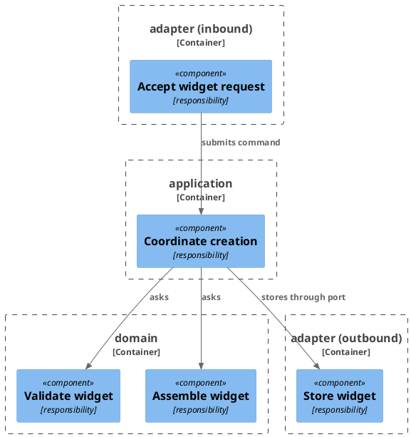

# Example Plan — Worked Example

This is a complete worked example of a plan file produced by the `plan-task` skill — in a real repo this file would
live at `docs/1-add-widget/plan.md`, and its whole directory moves to `docs/implemented/` once every checkbox
is ticked. It is
illustrated with a Java/Spring-Boot-flavored `Widget` feature purely for concreteness — other stacks adapt the same
structure (plan sections, section order, step formats, RED/GREEN choreography) using their own tech stack, tools,
and file formats as recorded in the module's `docs/conventions.md`
(see `.claude/templates/conventions/`).

What the feature *is* — the requirements, the scenarios and the decisions — lives in
`.claude/skills/design-task/example-spec.md`; how it is built — the solution, the data, the diagrams — in
the design artifacts that spec links. This plan is written from both. It links them rather than restating them, and
shows the architecture choice a person reviews, then gives the step map. What the review found and what the
run recorded is
[`example-plan-log.md`](example-plan-log.md), the `plan-log.md` that sits beside every plan.

Every item below is in one of the formats specified in [`step-formats.md`](step-formats.md); read that for the
rules, and this for what they look like when written out.

---

# Plan: Add Widget Creation

**Format:** 2
**Affected Modules:** `module-a`
**Spec:** [Add Widget Creation](spec.md)

The design lists one module, so this task holds one plan at `docs/1-add-widget/plan.md` and the link above is a
bare sibling. Had it listed two, there would be `module-a/plan.md` and `module-b/plan.md` — each linking
`../spec.md` and each run as its own pipeline — plus a `shared/plan.md` holding anything both of them read,
implemented first so that neither waits on the other.

## Architecture Decisions

### Keep widget rules inside the domain



**Placement:** The domain owns validation and assembly; the application coordinates them through ports.

## Step-by-Step Implementation Map (To-Do List)

### Stabilization

#### API Contract

- [ ] ST01 · Add `POST /widgets` path to the project's API schema file `<api-schema-file>`:
  - writes: `<api-schema-file>`
  ```yaml
  /widgets:
    post:
      operationId: createWidget
      requestBody:
        required: true
        content:
          application/json:
            schema:
              $ref: '#/components/schemas/CreateWidgetRequest'
      responses:
        '200':
          content:
            application/json:
              schema:
                $ref: '#/components/schemas/Widget'
  ```
- [ ] ST02 · Add `CreateWidgetRequest` schema to `<api-schema-file>`: `name` (string, required, max 255), `value` (string,
  required, max 255)
  - writes: `<api-schema-file>`
- [ ] ST03 · Add `Widget` response schema to `<api-schema-file>`: `id` (integer), `name` (string), `value` (string)
  - writes: `<api-schema-file>`

#### Database

- [ ] ST04 · Add migration `<migration-file>` (named per the project's migration tool conventions), as designed:
  - writes: `<migration-file>`
  ```sql
  CREATE TABLE widget (
      id        BIGSERIAL PRIMARY KEY,
      parent_id BIGINT       NOT NULL REFERENCES parent (id) ON DELETE CASCADE,
      name      VARCHAR(255) NOT NULL,
      value     VARCHAR(255) NOT NULL
  );

  CREATE UNIQUE INDEX idx_widget_parent_name ON widget (parent_id, name);
  ```

#### Interface-First / Build Stabilization

New-method stubs must carry a short inline comment describing the implementation intent, for example:

```java
public Settings loadSettings(long userId) {
    // retrieves language settings and the user's word lists for the given user
    return null;
}
```

**Interface & Signature Sync**

- [ ] ST05 · Add `createWidget(CreateWidgetCommand command): Widget` to the `CreateWidgetPort` inbound port
  (interface only — the implementation stub goes on `CreateWidgetUseCase` below)
  - writes: `<CreateWidgetPort-file>`
- [ ] ST06 · Add `save(Widget widget): Widget` to the `WidgetRepository` outbound port
  - writes: `<WidgetRepository-file>`
- [ ] ST07 · Stub `CreateWidgetUseCase.createWidget()` · after: ST05
  - writes: `<CreateWidgetUseCase-file>`
  ```java
  public Widget createWidget(CreateWidgetCommand command) {
      // validates the command, assembles a Widget via WidgetAssembler, and persists it via WidgetRepository
      return null;
  }
  ```
- [ ] ST08 · Stub `WidgetRepositoryAdapter.save()` · after: ST06
  - writes: `<WidgetRepositoryAdapter-file>`
  ```java
  public Widget save(Widget widget) {
      // maps the domain Widget to a WidgetEntity, persists it, and returns the domain Widget with its generated id
      return null;
  }
  ```
- [ ] ST09 · Update `WidgetController.createWidget()` to call `createWidgetPort.createWidget(...)` · after: ST05
  - writes: `<WidgetController-file>`

**Shared Test Infrastructure**

- [ ] ST10 · Add a `WidgetTestDataFactory` (`aWidget()`, `aWidget().withName(...)`) to the module's shared test-fixture
  location — both `WidgetRepositoryAdapterTest` (Integration Red Phase) and `CreateWidgetTest` (System Test Red
  Phase) need a valid widget precondition, and neither Red Phase step is scoped to create shared fixtures on its
  own
  - writes: `<WidgetTestDataFactory-file>`

### Red Phase

#### TDD Unit Red Phase

- [ ] RU01 · `CreateWidgetUseCase` · test: `CreateWidgetUseCaseTest` · covers: `createWidget()`, `validateRequest()` · scenarios: AC01, AC02
    - `createWidget()`:
        - given: a valid request
          when: createWidget() is called
          then: returns the created widget
        - given: an invalid request
          when: createWidget() is called
          then: throws IllegalArgumentException
    - `validateRequest()`:
        - given: a valid request
          when: validateRequest() is called
          then: no exception is thrown
        - given: a null request
          when: validateRequest() is called
          then: throws NullPointerException
- [ ] RU02 · `WidgetAssembler` · test: `WidgetAssemblerTest` · covers: `assemble()`, `normalize()`
    - `assemble()`:
        - given: a list of parts
          when: assemble() is called
          then: returns the parts combined into a widget
        - given: an empty part list
          when: assemble() is called
          then: returns an empty widget
    - `normalize()`:
        - given: mixed-case input
          when: normalize() is called
          then: returns lowercase result
        - given: input with leading and trailing spaces
          when: normalize() is called
          then: returns trimmed result
- [ ] RU03 · `WidgetUtils` · test: `WidgetUtilsTest` · covers: `toRest()`
    - `toRest()`:
        - given: a fully populated domain object
          when: toRest() is called
          then: all fields are mapped correctly
        - given: a domain object with a null optional field
          when: toRest() is called
          then: null is preserved in the response
        - update: `whenGadgetIsMapped_thenResponseCarriesItsFields()` — the response record gained `value`, so
          assert it alongside the fields the test already checks; without this the test compiles and passes while
          asserting nothing about the new field

#### TDD Integration Red Phase

- [ ] RI01 · `WidgetRepositoryAdapter` · test: `WidgetRepositoryAdapterTest` · covers: `findById()`,
  `save()` · scenarios: AC04, AC05
    - `findById()`:
        - given: an existing widget
          when: findById() is called
          then: returns the widget
        - given: an unknown widget id
          when: findById() is called
          then: throws ResourceNotFoundException
    - `save()`:
        - given: a valid widget
          when: save() is called
          then: the widget is persisted
        - given: an unknown parent id
          when: save() is called
          then: throws ResourceNotFoundException
        - given: a widget whose name is already taken under the same parent
          when: save() is called
          then: throws DuplicateResourceException
- [ ] RI02 · `WidgetController` · test: `WidgetControllerTest` · covers: `POST /widgets` · mocks: `CreateWidgetPort` · scenarios: AC02, AC03
    - Happy Path:
        - given: the mocked port returns a created widget
          when: request is made with a valid payload
          then: the port is called with the mapped command and 200 is returned with the widget response
    - Error Mapping:
        - given: the mocked port throws ResourceNotFoundException
          when: request is made
          then: return 404
        - given: the mocked port throws DuplicateResourceException
          when: request is made
          then: return 409
        - given: the mocked port throws PersistenceFailedException
          when: request is made
          then: return 503
    - Validation: `name` — blank, null, exceeds max length

#### Performance

- [ ] RS09 · `Nothing` · covers: `GET /x` · scenarios: AC01
  - given: a
    when: b
    then: c

#### TDD System Test Red Phase

- [ ] RS01 · `CreateWidgetTest` · covers: `POST /widgets` · scenarios: AC01, AC03
    - Happy Path:
        - given: a valid parent resource
          when: request is made with a valid payload
          then: return 200 with the created widget
    - Unhappy Path:
        - given: an unknown parent id
          when: create request is made
          then: return 404

### Green Phase

#### TDD Unit Green Phase

- [ ] GU01 · `CreateWidgetUseCase` · test: `CreateWidgetUseCaseTest`
- [ ] GU02 · `WidgetAssembler` · test: `WidgetAssemblerTest`
- [ ] GU03 · `WidgetUtils` · test: `WidgetUtilsTest`

#### TDD Integration Green Phase

- [ ] GI01 · `WidgetRepositoryAdapter` · test: `WidgetRepositoryAdapterTest`
- [ ] GI02 · `WidgetController` · test: `WidgetControllerTest` · covers: `POST /widgets` · mocks: `CreateWidgetPort` ·
  after: GU03

#### TDD System Test Green Phase

- [ ] GS01 · `CreateWidgetTest` · covers: `POST /widgets`

### Post-Implementation Steps

#### Performance

- [ ] PM01 · `CreateWidgetPerfTest` · covers: `POST /widgets` · scenarios: AC01
  - threshold: 300 ms at the 95th percentile, 50 concurrent callers
  - given: 10,000 widgets stored under one parent, 50 concurrent callers
    when: each caller posts a valid widget
    then: the 95th-percentile response time, bounded by the threshold
- [ ] PM02 · `ListWidgetsPerfTest` · covers: `GET /widgets` · rerun

#### Manual Request Files

- [ ] PI01 · Update `.http` files to reflect the new request shape

## Open Questions

- **OQ01:** `module-a`'s integration tests need a containerized database; the CI runner has no container runtime
  configured, so `RI01` cannot run there until it does. Run it locally, or configure the runner first?
  - A:
